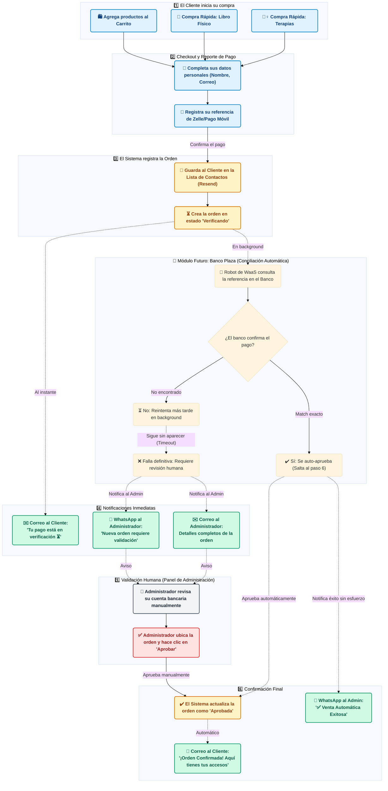

# Flujo de Experiencia de Compra (QA & Negocio)

Este diagrama documenta la experiencia de compra desde la perspectiva del cliente y del administrador. Está diseñado para entender funcionalmente qué ocurre en cada paso sin entrar en detalles técnicos.

